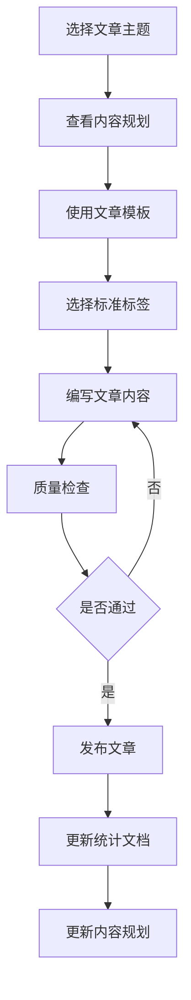

# Design Document

## Overview

本设计文档描述了博客内容完善系统的架构和实现方案。该系统是一个基于 Hugo 静态站点生成器的内容管理工作流，通过标准化的文档结构和自动化工具来确保文章质量和一致性。

系统的核心目标是：
1. 提供标准化的文章创建流程
2. 维护一致的标签体系
3. 自动更新文档统计信息
4. 确保文章质量符合标准

## Architecture

### 系统架构

```
博客内容管理系统
├── 文档层 (.docs/)
│   ├── 标签库 (01-tags-library.md)
│   ├── 文章模板 (02-article-template.md)
│   ├── 写作指南 (03-writing-guide.md)
│   ├── 标签统计 (04-tags-usage-statistics.md)
│   └── 内容规划 (05-content-plan.md)
│
├── 内容层 (content/)
│   └── posts/ (文章目录)
│
└── 配置层
    └── hugo.toml (Hugo 配置)
```

### 工作流程



## Components and Interfaces

### 1. 文章创建组件

**职责：** 根据模板创建符合规范的新文章

**输入：**
- 文章主题
- 目标字数范围
- 优先级级别

**输出：**
- 完整的 Markdown 文章文件
- 包含正确的 Front Matter
- 符合写作指南的内容结构

**接口：**
```python
def create_article(
    title: str,
    tags: List[str],
    target_word_count: int,
    priority: str
) -> str:
    """
    创建新文章
    
    Args:
        title: 文章标题
        tags: 标签列表（3-5个）
        target_word_count: 目标字数
        priority: 优先级 (P0/P1/P2)
    
    Returns:
        文章文件路径
    """
```

### 2. 标签管理组件

**职责：** 维护标签库的一致性，验证标签使用

**输入：**
- 文章标签列表
- 标签库定义

**输出：**
- 标签验证结果
- 标签使用建议

**接口：**
```python
def validate_tags(
    article_tags: List[str],
    tag_library: Dict[str, TagDefinition]
) -> ValidationResult:
    """
    验证文章标签
    
    Args:
        article_tags: 文章使用的标签
        tag_library: 标签库定义
    
    Returns:
        验证结果，包含错误和建议
    """
```

### 3. 统计更新组件

**职责：** 自动更新文档统计信息

**输入：**
- 新文章信息
- 现有统计数据

**输出：**
- 更新后的统计文档

**接口：**
```python
def update_statistics(
    article_info: ArticleInfo,
    statistics_doc: str
) -> str:
    """
    更新统计文档
    
    Args:
        article_info: 文章信息（标题、标签、日期等）
        statistics_doc: 统计文档路径
    
    Returns:
        更新后的文档内容
    """
```

### 4. 质量检查组件

**职责：** 检查文章是否符合质量标准

**输入：**
- 文章内容
- 质量标准定义

**输出：**
- 检查结果报告
- 改进建议列表

**接口：**
```python
def check_article_quality(
    article_path: str,
    quality_standards: QualityStandards
) -> QualityReport:
    """
    检查文章质量
    
    Args:
        article_path: 文章文件路径
        quality_standards: 质量标准定义
    
    Returns:
        质量检查报告
    """
```

## Data Models

### ArticleInfo

```python
@dataclass
class ArticleInfo:
    """文章信息"""
    title: str              # 文章标题
    date: str               # 发布日期 (YYYY-MM-DD)
    tags: List[str]         # 标签列表
    categories: List[str]   # 分类列表
    description: str        # 文章描述
    draft: bool             # 是否草稿
    file_path: str          # 文件路径
    word_count: int         # 字数
```

### TagDefinition

```python
@dataclass
class TagDefinition:
    """标签定义"""
    name: str               # 标签名称
    category: str           # 标签类别（语言/框架/数据库等）
    description: str        # 标签说明
    usage_count: int        # 使用次数
```

### QualityStandards

```python
@dataclass
class QualityStandards:
    """质量标准"""
    min_word_count: int = 2500      # 最小字数
    max_word_count: int = 4000      # 最大字数
    min_tags: int = 3               # 最少标签数
    max_tags: int = 5               # 最多标签数
    require_code_examples: bool = True  # 是否需要代码示例
    require_summary: bool = True    # 是否需要总结
```

### ValidationResult

```python
@dataclass
class ValidationResult:
    """验证结果"""
    is_valid: bool          # 是否通过验证
    errors: List[str]       # 错误列表
    warnings: List[str]     # 警告列表
    suggestions: List[str]  # 建议列表
```

### QualityReport

```python
@dataclass
class QualityReport:
    """质量报告"""
    passed: bool            # 是否通过
    score: float            # 质量分数 (0-100)
    checks: Dict[str, bool] # 各项检查结果
    issues: List[str]       # 问题列表
    recommendations: List[str]  # 改进建议
```


## Correctness Properties

*A property is a characteristic or behavior that should hold true across all valid executions of a system—essentially, a formal statement about what the system should do. Properties serve as the bridge between human-readable specifications and machine-verifiable correctness guarantees.*

### Property 1: Tag Library Membership and Composition

*For any* article, all tags must exist in Tag_Library, the total count must be 3-5, and must include exactly 1 subject tag from language/framework/database categories.

**Validates: Requirements 1.2, 1.3, 3.1, 8.2**

### Property 2: Article Template Conformance

*For any* newly created article, the structure must match the standard template including Front Matter format and section organization.

**Validates: Requirements 1.1**

### Property 3: Statistics Synchronization

*For any* article creation or modification, the Statistics_Doc must be updated to include the article record, updated tag frequency counts, and correct article total count.

**Validates: Requirements 1.6, 4.1, 4.2, 4.3, 4.4**

### Property 4: Content Plan Tracking

*For any* completed article, the Content_Plan must mark it as completed with date, and the completion progress percentage must equal (completed_count / total_count) * 100.

**Validates: Requirements 2.3, 2.4, 2.5, 4.5**

### Property 5: Priority-Based Selection

*For any* article selection from Content_Plan, if incomplete P0 articles exist, a P0 article must be selected; otherwise select from P1, then P2.

**Validates: Requirements 2.1, 2.2**

### Property 6: Quality Standards Compliance

*For any* published article (draft: false), it must have word count in range (2500-4000), contain at least one code block (for technical articles), include required sections (opening, main content, summary), and have description length 50-100 characters.

**Validates: Requirements 5.1, 5.2, 5.3, 5.5, 8.3, 8.4**

### Property 7: Front Matter Validity

*For any* article, the Front Matter must contain all required fields (title, date, tags, categories, description, draft), date must be YYYY-MM-DD format and not future, and all fields must be non-empty.

**Validates: Requirements 8.1**

### Property 8: Heading Hierarchy

*For any* article, heading levels must follow proper hierarchy without skipping levels (e.g., ## can be followed by ### but not ####).

**Validates: Requirements 5.4**

### Property 9: Tag Library Precedence

*For any* new tag usage, the tag must exist in Tag_Library with complete definition (name, category, description) before being used in any article.

**Validates: Requirements 3.2, 3.3**

### Property 10: Tag Normalization

*For any* article with non-standard tags, those tags must be replaced with standard Tag_Library tags before publication.

**Validates: Requirements 3.5**

### Property 11: Series Consistency

*For any* article in a series, it must reference other articles in the series and share common tags with other series articles.

**Validates: Requirements 6.1, 6.3**

### Property 12: Series Completeness

*For any* completed series, all planned topics from the Content_Plan must be covered by published articles.

**Validates: Requirements 6.4**

### Property 13: Cascading Document Updates

*For any* article state change, all related documents (Statistics_Doc, Content_Plan) must be updated automatically.

**Validates: Requirements 7.1, 7.2, 7.3**

### Property 14: Document Timestamp Freshness

*For any* document modification in .docs/, the "最后更新" timestamp must be updated to the current date.

**Validates: Requirements 7.4**

### Property 15: Validation Feedback

*For any* article that fails quality checks, the system must provide specific error messages and actionable improvement suggestions.

**Validates: Requirements 8.5**

### Property 16: Draft Status Transition

*For any* article marked as completed, the draft field must be set to false.

**Validates: Requirements 1.5**

### Property 17: Interview Article Structure Completeness

*For any* interview article (八股文), it must contain all required sections: introduction, basic concepts, principle analysis, common questions (at least 3), best practices, and summary.

**Validates: Requirements 9.4**

### Property 18: Interview Question Quality

*For any* interview question in an article, it must include the question text, detailed answer, and at least one follow-up question.

**Validates: Requirements 9.2, 9.3**

### Property 19: Knowledge Domain Coverage

*For any* interview article series, all planned knowledge points for that domain must be covered before the series is marked complete.

**Validates: Requirements 9.1, 9.5, 10.4**

### Property 20: Interview Article Priority

*For any* interview article selection, high-frequency (高频) knowledge points must be created before medium-frequency (中频) and low-frequency (低频) points.

**Validates: Requirements 10.2, 10.3**

## Error Handling

### 1. Invalid Tag Errors

**Scenario:** Article uses tags not in Tag_Library

**Handling:**
- Detect non-standard tags during validation
- Provide list of similar standard tags as suggestions
- Prevent article publication until tags are corrected
- Log the error with article path and invalid tags

### 2. Missing Front Matter Fields

**Scenario:** Article Front Matter is incomplete

**Handling:**
- Validate all required fields before publication
- Provide clear error message indicating missing fields
- Suggest default values where applicable
- Prevent publication until all fields are present

### 3. Word Count Out of Range

**Scenario:** Article word count is outside planned range

**Handling:**
- Issue warning (not error) if word count is ±20% of target
- Suggest content expansion or reduction strategies
- Allow publication with warning acknowledgment
- Log the deviation for review

### 4. Duplicate Article Title

**Scenario:** New article has same title as existing article

**Handling:**
- Check for title uniqueness before creation
- Suggest alternative titles
- Prevent creation of duplicate
- Provide link to existing article

### 5. Statistics Update Failure

**Scenario:** Unable to update statistics document

**Handling:**
- Retry update operation once
- If retry fails, log error with details
- Continue with article publication
- Queue manual statistics review

### 6. Content Plan Sync Error

**Scenario:** Article completed but Content_Plan not updated

**Handling:**
- Attempt automatic update
- If fails, create manual review task
- Log discrepancy for later resolution
- Ensure article is still published

### 7. Code Block Missing

**Scenario:** Technical article lacks code examples

**Handling:**
- Issue warning during quality check
- Suggest adding code examples
- Allow publication with explicit override
- Mark for content review

### 8. Invalid Date Format

**Scenario:** Article date is malformed or future date

**Handling:**
- Reject article with clear error message
- Suggest correct date format
- Provide current date as default
- Prevent publication until corrected

## Testing Strategy

### Unit Testing

Unit tests will verify specific examples and edge cases for each component:

**Article Creation Tests:**
- Test creating article with valid inputs
- Test handling of special characters in title
- Test Front Matter generation
- Test file path generation

**Tag Validation Tests:**
- Test validation with all valid tags
- Test detection of invalid tags
- Test tag count validation (too few, too many)
- Test tag composition validation

**Statistics Update Tests:**
- Test adding new article to statistics
- Test updating tag usage counts
- Test progress percentage calculation
- Test handling of existing articles

**Quality Check Tests:**
- Test word count validation
- Test code block detection
- Test structure validation
- Test Front Matter completeness

### Property-Based Testing

Property tests will verify universal properties across all inputs using a property-based testing library (Hypothesis for Python or fast-check for TypeScript):

**Configuration:**
- Minimum 100 iterations per property test
- Each test tagged with feature name and property number
- Tests reference design document properties

**Property Test Examples:**

```python
# Property 1: Tag Consistency
@given(article=article_generator(), tag_library=tag_library_generator())
def test_tag_consistency(article, tag_library):
    """
    Feature: blog-content-enhancement, Property 1
    For any article, all tags must exist in tag library
    """
    validation_result = validate_tags(article.tags, tag_library)
    assert all(tag in tag_library for tag in article.tags)

# Property 2: Tag Count Bounds
@given(article=article_generator())
def test_tag_count_bounds(article, tag_library):
    """
    Feature: blog-content-enhancement, Property 2
    For any article, tag count must be 3-5
    """
    assert 3 <= len(article.tags) <= 5

# Property 7: Front Matter Completeness
@given(article=article_generator())
def test_front_matter_completeness(article):
    """
    Feature: blog-content-enhancement, Property 7
    For any article, Front Matter must have all required fields
    """
    required_fields = ['title', 'date', 'tags', 'categories', 'description', 'draft']
    assert all(hasattr(article, field) for field in required_fields)
```

### Integration Testing

Integration tests will verify component interactions:

- Test complete article creation workflow
- Test statistics update after article creation
- Test content plan update after article completion
- Test quality check integration with article creation

### Manual Testing

Some aspects require manual verification:

- Article readability and flow
- Code example quality and correctness
- Technical accuracy of content
- Visual formatting in Hugo output

### Testing Balance

- Unit tests focus on specific examples and edge cases
- Property tests handle comprehensive input coverage through randomization
- Both are complementary and necessary for complete coverage
- Avoid writing too many unit tests - property tests cover many input variations


### 5. 八股文内容生成组件

**职责：** 创建系统化的八股文系列文章

**输入：**
- 技术领域（MySQL、Redis、算法、网络等）
- 知识点列表
- 重要程度标识

**输出：**
- 结构化的八股文文章
- 包含面试题和详细解答
- 原理分析和实战案例

**接口：**
```python
def create_interview_article(
    domain: str,
    knowledge_points: List[KnowledgePoint],
    priority: str
) -> str:
    """
    创建八股文文章
    
    Args:
        domain: 技术领域（MySQL/Redis/算法/网络等）
        knowledge_points: 知识点列表
        priority: 重要程度（高频/中频/低频）
    
    Returns:
        文章文件路径
    """
```

### KnowledgePoint

```python
@dataclass
class KnowledgePoint:
    """知识点定义"""
    name: str               # 知识点名称
    domain: str             # 所属领域
    frequency: str          # 面试频率（高频/中频/低频）
    difficulty: str         # 难度级别（基础/中级/高级）
    related_points: List[str]  # 相关知识点
    interview_questions: List[str]  # 常见面试题
```

### InterviewArticleStructure

```python
@dataclass
class InterviewArticleStructure:
    """八股文文章结构"""
    introduction: str       # 引言（为什么重要）
    basic_concepts: str     # 基础概念
    principle_analysis: str # 原理分析
    common_questions: List[InterviewQuestion]  # 常见问题
    best_practices: str     # 最佳实践
    summary: str            # 总结
```

### InterviewQuestion

```python
@dataclass
class InterviewQuestion:
    """面试题"""
    question: str           # 问题
    answer: str             # 详细解答
    code_example: str       # 代码示例（可选）
    follow_up: List[str]    # 追问问题
```

## 八股文系列设计

### 内容规划原则

1. **系统性**：按技术领域系统化组织知识点
2. **实用性**：聚焦高频面试题和实际应用
3. **深度性**：不仅回答"是什么"，更要解释"为什么"
4. **关联性**：建立知识点之间的关联关系

### 八股文系列分类

#### MySQL 系列
- 索引原理与优化
- 事务与锁机制
- 查询优化
- 主从复制与高可用
- 分库分表

#### Redis 系列
- 数据结构与底层实现
- 持久化机制
- 缓存策略与问题
- 集群与高可用
- 性能优化

#### 数据结构与算法系列
- 基础数据结构（数组、链表、栈、队列、树、图）
- 排序算法
- 查找算法
- 动态规划
- 常见算法题型

#### 计算机网络系列
- TCP/IP 协议栈
- HTTP/HTTPS 协议
- 网络安全
- 负载均衡
- CDN 原理

#### Java 基础系列
- 集合框架
- 并发编程
- JVM 原理
- 反射与注解
- IO 与 NIO

### 文章模板结构

```markdown
---
title: "[领域] 面试必备：[知识点]"
date: YYYY-MM-DD
tags: [主题标签, 面试, 原理分析]
categories: ["技术"]
description: "深入解析 [知识点]，涵盖原理、常见面试题及最佳实践"
draft: false
---

## 为什么要掌握这个知识点

[说明该知识点的重要性和应用场景]

## 基础概念

[核心概念定义和基本原理]

## 原理深入分析

[详细的原理解析，配合图示]

## 常见面试题

### 问题1：[高频面试题]

**问题：** [具体问题]

**解答：**
[详细解答，包含原理分析]

**代码示例：**
```java
// 示例代码
```

**追问：** [可能的追问问题]

### 问题2：[高频面试题]
...

## 实战应用

[实际项目中的应用场景和最佳实践]

## 总结

[知识点总结和学习建议]

## 参考资料

[相关文档和资料链接]
```
