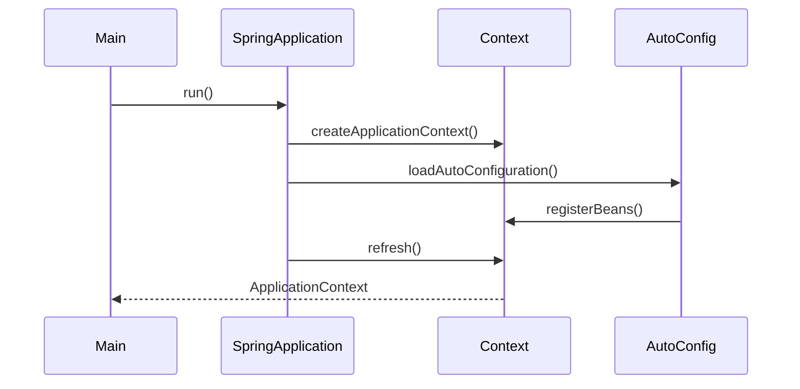

阅读优秀的开源项目源码是提升技术能力的最佳途径之一。然而，面对动辄几十万行的代码，很多人不知道从何下手。本文将以Spring Boot为例，系统讲解如何高效地阅读和学习开源项目源码。

### 本文亮点
- [x] 掌握源码阅读的系统方法论
- [x] 学会使用工具辅助源码阅读
- [x] 理解Spring Boot的核心设计思想
- [x] 掌握从宏观到微观的阅读策略
- [x] 建立源码学习的长效机制

---

## 为什么要读源码

### 源码阅读的价值

1. **深入理解原理**：知其然，更知其所以然
2. **学习设计模式**：看大师如何设计架构
3. **提升编码能力**：学习优秀的代码风格
4. **解决疑难问题**：遇到问题能快速定位
5. **参与开源贡献**：为开源社区做贡献

### 常见误区

❌ **从第一行开始读**：容易迷失在细节中
❌ **追求完全理解**：试图理解每一行代码
❌ **没有目标**：漫无目的地浏览代码
❌ **只看不练**：只看不写，无法真正掌握

✅ **带着问题读**：围绕具体问题展开
✅ **抓住主线**：理解核心流程和设计思想
✅ **循序渐进**：从简单到复杂，逐步深入
✅ **边读边写**：通过实践加深理解

> **架构思考：** 阅读源码不是为了记住每一行代码，而是理解设计思想和架构模式。要学会从宏观到微观，从整体到细节的阅读方法。

---

## 源码阅读方法论

### 1. 准备阶段

**选择合适的版本**：
- 选择稳定版本（如Spring Boot 2.7.x）
- 避免选择最新的开发版本
- 查看版本的Release Notes

**搭建调试环境**：

```bash
# 1. 克隆源码
git clone https://github.com/spring-projects/spring-boot.git
cd spring-boot

# 2. 切换到稳定版本
git checkout v2.7.18

# 3. 导入IDE（IDEA）
# File -> Open -> 选择spring-boot目录
```

**准备示例项目**：

```xml
<!-- pom.xml -->
<parent>
    <groupId>org.springframework.boot</groupId>
    <artifactId>spring-boot-starter-parent</artifactId>
    <version>2.7.18</version>
</parent>

<dependencies>
    <dependency>
        <groupId>org.springframework.boot</groupId>
        <artifactId>spring-boot-starter-web</artifactId>
    </dependency>
</dependencies>
```

### 2. 宏观阶段

**了解项目结构**：

```
spring-boot/
├── spring-boot-project/
│   ├── spring-boot/              # 核心模块
│   ├── spring-boot-autoconfigure/ # 自动配置
│   ├── spring-boot-starters/     # Starter依赖
│   ├── spring-boot-actuator/     # 监控端点
│   └── spring-boot-test/         # 测试支持
├── spring-boot-samples/          # 示例项目
└── spring-boot-tests/            # 集成测试
```

**阅读官方文档**：
- [Spring Boot Reference Documentation](https://docs.spring.io/spring-boot/docs/current/reference/html/)
- 了解核心特性和使用方式
- 理解设计理念和架构思想

**绘制架构图**：

```
应用启动
  ↓
@SpringBootApplication
  ↓
SpringApplication.run()
  ↓
创建ApplicationContext
  ↓
自动配置（AutoConfiguration）
  ↓
启动内嵌Web服务器
  ↓
应用就绪
```

### 3. 微观阶段

**选择切入点**：
- 从最常用的功能开始（如启动流程）
- 从遇到的问题开始（如自动配置原理）
- 从感兴趣的特性开始（如条件注解）

**使用调试工具**：
- 断点调试：观察执行流程
- 调用栈：理解方法调用关系
- 变量监视：查看对象状态

---

## Spring Boot 启动流程分析

### 入口：@SpringBootApplication

```java
@SpringBootApplication
public class DemoApplication {
    public static void main(String[] args) {
        SpringApplication.run(DemoApplication.class, args);
    }
}
```

**@SpringBootApplication 注解**：

```java
@Target(ElementType.TYPE)
@Retention(RetentionPolicy.RUNTIME)
@Documented
@Inherited
@SpringBootConfiguration  // 1. 配置类
@EnableAutoConfiguration  // 2. 自动配置
@ComponentScan           // 3. 组件扫描
public @interface SpringBootApplication {
    // ...
}
```

**三个核心注解**：
1. `@SpringBootConfiguration`：标记为配置类
2. `@EnableAutoConfiguration`：启用自动配置
3. `@ComponentScan`：扫描组件

### SpringApplication.run() 流程

```java
public class SpringApplication {
    
    public static ConfigurableApplicationContext run(Class<?> primarySource, String... args) {
        return run(new Class<?>[] { primarySource }, args);
    }
    
    public static ConfigurableApplicationContext run(Class<?>[] primarySources, String[] args) {
        // 创建SpringApplication实例并运行
        return new SpringApplication(primarySources).run(args);
    }
    
    public ConfigurableApplicationContext run(String... args) {
        // 1. 创建StopWatch，记录启动时间
        StopWatch stopWatch = new StopWatch();
        stopWatch.start();
        
        // 2. 创建Bootstrap上下文
        DefaultBootstrapContext bootstrapContext = createBootstrapContext();
        ConfigurableApplicationContext context = null;
        
        // 3. 配置Headless属性
        configureHeadlessProperty();
        
        // 4. 获取SpringApplicationRunListeners
        SpringApplicationRunListeners listeners = getRunListeners(args);
        listeners.starting(bootstrapContext, this.mainApplicationClass);
        
        try {
            // 5. 准备环境
            ApplicationArguments applicationArguments = new DefaultApplicationArguments(args);
            ConfigurableEnvironment environment = prepareEnvironment(listeners, bootstrapContext, applicationArguments);
            
            // 6. 打印Banner
            Banner printedBanner = printBanner(environment);
            
            // 7. 创建ApplicationContext
            context = createApplicationContext();
            context.setApplicationStartup(this.applicationStartup);
            
            // 8. 准备Context
            prepareContext(bootstrapContext, context, environment, listeners, applicationArguments, printedBanner);
            
            // 9. 刷新Context（核心）
            refreshContext(context);
            
            // 10. 刷新后处理
            afterRefresh(context, applicationArguments);
            
            stopWatch.stop();
            
            // 11. 发布启动完成事件
            listeners.started(context);
            
            // 12. 调用Runners
            callRunners(context, applicationArguments);
        }
        catch (Throwable ex) {
            handleRunFailure(context, ex, listeners);
            throw new IllegalStateException(ex);
        }
        
        try {
            listeners.running(context);
        }
        catch (Throwable ex) {
            handleRunFailure(context, ex, null);
            throw new IllegalStateException(ex);
        }
        
        return context;
    }
}
```

**启动流程图**：

```
1. 创建StopWatch
   ↓
2. 创建Bootstrap上下文
   ↓
3. 获取RunListeners
   ↓
4. 准备Environment
   ↓
5. 打印Banner
   ↓
6. 创建ApplicationContext
   ↓
7. 准备Context
   ↓
8. 刷新Context（加载Bean）
   ↓
9. 调用Runners
   ↓
10. 发布启动完成事件
```

---

## 自动配置原理

### @EnableAutoConfiguration

```java
@Target(ElementType.TYPE)
@Retention(RetentionPolicy.RUNTIME)
@Documented
@Inherited
@AutoConfigurationPackage
@Import(AutoConfigurationImportSelector.class)  // 核心
public @interface EnableAutoConfiguration {
    // ...
}
```

### AutoConfigurationImportSelector

```java
public class AutoConfigurationImportSelector implements DeferredImportSelector {
    
    @Override
    public String[] selectImports(AnnotationMetadata annotationMetadata) {
        if (!isEnabled(annotationMetadata)) {
            return NO_IMPORTS;
        }
        
        // 1. 获取自动配置类
        AutoConfigurationEntry autoConfigurationEntry = getAutoConfigurationEntry(annotationMetadata);
        return StringUtils.toStringArray(autoConfigurationEntry.getConfigurations());
    }
    
    protected AutoConfigurationEntry getAutoConfigurationEntry(AnnotationMetadata annotationMetadata) {
        if (!isEnabled(annotationMetadata)) {
            return EMPTY_ENTRY;
        }
        
        AnnotationAttributes attributes = getAttributes(annotationMetadata);
        
        // 2. 加载候选配置类
        List<String> configurations = getCandidateConfigurations(annotationMetadata, attributes);
        
        // 3. 去重
        configurations = removeDuplicates(configurations);
        
        // 4. 排除指定的配置类
        Set<String> exclusions = getExclusions(annotationMetadata, attributes);
        checkExcludedClasses(configurations, exclusions);
        configurations.removeAll(exclusions);
        
        // 5. 过滤（根据条件注解）
        configurations = getConfigurationClassFilter().filter(configurations);
        
        // 6. 触发自动配置导入事件
        fireAutoConfigurationImportEvents(configurations, exclusions);
        
        return new AutoConfigurationEntry(configurations, exclusions);
    }
    
    protected List<String> getCandidateConfigurations(AnnotationMetadata metadata, AnnotationAttributes attributes) {
        // 从META-INF/spring.factories加载配置类
        List<String> configurations = SpringFactoriesLoader.loadFactoryNames(
            getSpringFactoriesLoaderFactoryClass(),
            getBeanClassLoader()
        );
        return configurations;
    }
}
```

### spring.factories

```properties
# spring-boot-autoconfigure/META-INF/spring.factories

org.springframework.boot.autoconfigure.EnableAutoConfiguration=\
org.springframework.boot.autoconfigure.admin.SpringApplicationAdminJmxAutoConfiguration,\
org.springframework.boot.autoconfigure.aop.AopAutoConfiguration,\
org.springframework.boot.autoconfigure.amqp.RabbitAutoConfiguration,\
org.springframework.boot.autoconfigure.jdbc.DataSourceAutoConfiguration,\
org.springframework.boot.autoconfigure.web.servlet.WebMvcAutoConfiguration,\
...
```

### 自动配置示例

```java
@Configuration(proxyBeanMethods = false)
@ConditionalOnClass({ DataSource.class, EmbeddedDatabaseType.class })
@ConditionalOnMissingBean(type = "io.r2dbc.spi.ConnectionFactory")
@EnableConfigurationProperties(DataSourceProperties.class)
@Import({ DataSourcePoolMetadataProvidersConfiguration.class })
public class DataSourceAutoConfiguration {
    
    @Configuration(proxyBeanMethods = false)
    @Conditional(EmbeddedDatabaseCondition.class)
    @ConditionalOnMissingBean({ DataSource.class, XADataSource.class })
    @Import(EmbeddedDataSourceConfiguration.class)
    protected static class EmbeddedDatabaseConfiguration {
    }
    
    @Configuration(proxyBeanMethods = false)
    @Conditional(PooledDataSourceCondition.class)
    @ConditionalOnMissingBean({ DataSource.class, XADataSource.class })
    @Import({ DataSourceConfiguration.Hikari.class, DataSourceConfiguration.Tomcat.class,
            DataSourceConfiguration.Dbcp2.class, DataSourceConfiguration.OracleUcp.class,
            DataSourceConfiguration.Generic.class, DataSourceJmxConfiguration.class })
    protected static class PooledDataSourceConfiguration {
    }
}
```

**条件注解**：
- `@ConditionalOnClass`：类路径存在指定类
- `@ConditionalOnMissingBean`：容器中不存在指定Bean
- `@ConditionalOnProperty`：配置文件存在指定属性

---

## 条件注解原理

### @Conditional

```java
@Target({ ElementType.TYPE, ElementType.METHOD })
@Retention(RetentionPolicy.RUNTIME)
@Documented
public @interface Conditional {
    Class<? extends Condition>[] value();
}
```

### Condition接口

```java
@FunctionalInterface
public interface Condition {
    boolean matches(ConditionContext context, AnnotatedTypeMetadata metadata);
}
```

### OnClassCondition实现

```java
@Order(Ordered.HIGHEST_PRECEDENCE)
class OnClassCondition extends FilteringSpringBootCondition {
    
    @Override
    public ConditionOutcome getMatchOutcome(ConditionContext context, AnnotatedTypeMetadata metadata) {
        ClassLoader classLoader = context.getClassLoader();
        ConditionMessage matchMessage = ConditionMessage.empty();
        
        // 获取@ConditionalOnClass注解的value
        List<String> onClasses = getCandidates(metadata, ConditionalOnClass.class);
        if (onClasses != null) {
            // 检查类是否存在
            List<String> missing = filter(onClasses, ClassNameFilter.MISSING, classLoader);
            if (!missing.isEmpty()) {
                return ConditionOutcome.noMatch(
                    ConditionMessage.forCondition(ConditionalOnClass.class)
                        .didNotFind("required class", "required classes")
                        .items(Style.QUOTE, missing)
                );
            }
            matchMessage = matchMessage.andCondition(ConditionalOnClass.class)
                .found("required class", "required classes")
                .items(Style.QUOTE, filter(onClasses, ClassNameFilter.PRESENT, classLoader));
        }
        
        // 获取@ConditionalOnMissingClass注解的value
        List<String> onMissingClasses = getCandidates(metadata, ConditionalOnMissingClass.class);
        if (onMissingClasses != null) {
            // 检查类是否不存在
            List<String> present = filter(onMissingClasses, ClassNameFilter.PRESENT, classLoader);
            if (!present.isEmpty()) {
                return ConditionOutcome.noMatch(
                    ConditionMessage.forCondition(ConditionalOnMissingClass.class)
                        .found("unwanted class", "unwanted classes")
                        .items(Style.QUOTE, present)
                );
            }
            matchMessage = matchMessage.andCondition(ConditionalOnMissingClass.class)
                .didNotFind("unwanted class", "unwanted classes")
                .items(Style.QUOTE, filter(onMissingClasses, ClassNameFilter.MISSING, classLoader));
        }
        
        return ConditionOutcome.match(matchMessage);
    }
}
```

---

## 源码阅读技巧

### 1. 使用IDEA调试

**设置断点**：
```java
// 在关键方法设置断点
public ConfigurableApplicationContext run(String... args) {
    // 断点1：启动入口
    StopWatch stopWatch = new StopWatch();
    stopWatch.start();
    
    // 断点2：创建Context
    context = createApplicationContext();
    
    // 断点3：刷新Context
    refreshContext(context);
    
    return context;
}
```

**查看调用栈**：
- 使用`Ctrl+Alt+H`查看方法调用层次
- 使用`Alt+F7`查找方法使用位置

**条件断点**：
```java
// 只在特定条件下触发断点
if (beanName.equals("dataSource")) {
    // 断点：只在创建dataSource时触发
}
```

### 2. 绘制流程图

使用工具绘制关键流程：
- Draw.io
- PlantUML
- Mermaid



### 3. 做笔记

**记录关键点**：
- 核心类和接口
- 设计模式的应用
- 巧妙的实现技巧
- 疑问和待研究的问题

**示例笔记**：
```markdown
## SpringApplication启动流程

### 核心方法
- `run(String... args)`: 启动入口
- `prepareEnvironment()`: 准备环境
- `createApplicationContext()`: 创建上下文
- `refreshContext()`: 刷新上下文

### 设计模式
- 模板方法：run()方法定义流程，子类可扩展
- 策略模式：ApplicationContextFactory创建不同类型的Context
- 观察者模式：SpringApplicationRunListeners监听启动事件

### 疑问
- [ ] Environment是如何加载配置文件的？
- [ ] Bean的循环依赖是如何解决的？
```

### 4. 写测试代码

**验证理解**：
```java
@Test
public void testAutoConfiguration() {
    // 1. 创建AnnotationConfigApplicationContext
    AnnotationConfigApplicationContext context = 
        new AnnotationConfigApplicationContext();
    
    // 2. 注册配置类
    context.register(DataSourceAutoConfiguration.class);
    
    // 3. 刷新容器
    context.refresh();
    
    // 4. 验证Bean是否创建
    DataSource dataSource = context.getBean(DataSource.class);
    assertNotNull(dataSource);
}
```

**模仿实现**：
```java
// 模仿Spring Boot的条件注解
@Target({ ElementType.TYPE, ElementType.METHOD })
@Retention(RetentionPolicy.RUNTIME)
@Conditional(OnMyClassCondition.class)
public @interface ConditionalOnMyClass {
    String value();
}

public class OnMyClassCondition implements Condition {
    @Override
    public boolean matches(ConditionContext context, AnnotatedTypeMetadata metadata) {
        Map<String, Object> attributes = metadata.getAnnotationAttributes(
            ConditionalOnMyClass.class.getName()
        );
        String className = (String) attributes.get("value");
        
        try {
            Class.forName(className);
            return true;
        } catch (ClassNotFoundException e) {
            return false;
        }
    }
}
```

---

## 学习路径建议

### 初级阶段（1-2周）

**目标**：理解Spring Boot的基本使用和核心概念

1. 阅读官方文档
2. 运行示例项目
3. 理解@SpringBootApplication注解
4. 了解自动配置的基本原理

**推荐阅读**：
- `SpringApplication.java`
- `@SpringBootApplication`相关注解
- 简单的AutoConfiguration类

### 中级阶段（2-4周）

**目标**：深入理解启动流程和自动配置机制

1. 调试启动流程
2. 分析AutoConfigurationImportSelector
3. 研究条件注解的实现
4. 学习常用的AutoConfiguration

**推荐阅读**：
- `SpringApplication.run()`完整流程
- `AutoConfigurationImportSelector.java`
- `OnClassCondition.java`
- `DataSourceAutoConfiguration.java`
- `WebMvcAutoConfiguration.java`

### 高级阶段（1-2个月）

**目标**：掌握Spring Boot的设计思想和扩展机制

1. 研究SPI机制（SpringFactoriesLoader）
2. 分析ApplicationContext的创建和刷新
3. 学习Actuator的实现
4. 研究Spring Boot的测试支持

**推荐阅读**：
- `SpringFactoriesLoader.java`
- `ConfigurableApplicationContext`相关类
- `spring-boot-actuator`模块
- `spring-boot-test`模块

### 专家阶段（持续学习）

**目标**：参与开源贡献，深度定制Spring Boot

1. 阅读Issue和PR
2. 参与社区讨论
3. 提交Bug修复或新特性
4. 开发自定义Starter

---

## 实战：开发自定义Starter

### 1. 创建Starter项目

```xml
<!-- my-spring-boot-starter/pom.xml -->
<dependencies>
    <dependency>
        <groupId>org.springframework.boot</groupId>
        <artifactId>spring-boot-autoconfigure</artifactId>
    </dependency>
    <dependency>
        <groupId>org.springframework.boot</groupId>
        <artifactId>spring-boot-configuration-processor</artifactId>
        <optional>true</optional>
    </dependency>
</dependencies>
```

### 2. 定义配置属性

```java
@ConfigurationProperties(prefix = "my.service")
public class MyServiceProperties {
    
    private String name = "default";
    private int timeout = 3000;
    
    // getters and setters
}
```

### 3. 创建自动配置类

```java
@Configuration
@ConditionalOnClass(MyService.class)
@EnableConfigurationProperties(MyServiceProperties.class)
public class MyServiceAutoConfiguration {
    
    @Bean
    @ConditionalOnMissingBean
    public MyService myService(MyServiceProperties properties) {
        return new MyService(properties.getName(), properties.getTimeout());
    }
}
```

### 4. 注册自动配置

```properties
# META-INF/spring.factories
org.springframework.boot.autoconfigure.EnableAutoConfiguration=\
com.example.MyServiceAutoConfiguration
```

### 5. 使用Starter

```xml
<!-- 应用项目的pom.xml -->
<dependency>
    <groupId>com.example</groupId>
    <artifactId>my-spring-boot-starter</artifactId>
    <version>1.0.0</version>
</dependency>
```

```yaml
# application.yml
my:
  service:
    name: my-service
    timeout: 5000
```

```java
@SpringBootApplication
public class Application {
    
    @Autowired
    private MyService myService;  // 自动注入
    
    public static void main(String[] args) {
        SpringApplication.run(Application.class, args);
    }
}
```

---

## 总结与思考

本文系统讲解了如何阅读开源项目源码，以Spring Boot为例：

- **方法论**：从宏观到微观，带着问题读源码
- **启动流程**：理解SpringApplication.run()的完整流程
- **自动配置**：掌握@EnableAutoConfiguration的实现原理
- **条件注解**：学习@Conditional的设计和实现
- **学习路径**：从初级到专家的进阶路线
- **实战练习**：开发自定义Starter巩固理解

阅读源码的核心要点：
1. **目标明确**：带着问题和目标去读
2. **循序渐进**：从简单到复杂，逐步深入
3. **动手实践**：通过调试和编码加深理解
4. **持续学习**：源码阅读是一个长期过程

推荐的学习资源：
- [Spring Boot官方文档](https://docs.spring.io/spring-boot/docs/current/reference/html/)
- [Spring Boot源码](https://github.com/spring-projects/spring-boot)
- [Spring Framework源码](https://github.com/spring-projects/spring-framework)

下次当你想深入学习一个开源项目时，不妨按照本文的方法，系统性地阅读和学习。记住，源码阅读不是目的，理解设计思想和提升编码能力才是最终目标。